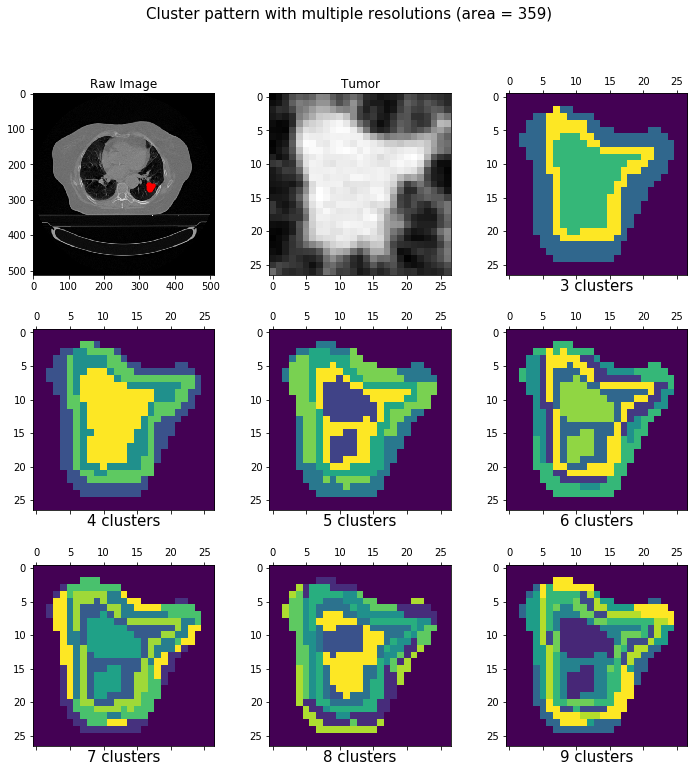

# ITHscore

ITHscore is a Python package to quantify intra-tumor heterogeneity level from CT images. ITHscore contains general data processing of medical images, so it can be used as a radiomic analysis pipeline.

ITHscore is designed and developed by Jiaqi Li from [XGlab](http://bioinfo.au.tsinghua.edu.cn/member/xuegonglab/ ), Tsinghua University. The work is collaborated with Prof. Wenzhao Zhong's group, Guangdong General Hospital. The package is freely for academic use. Please cite our paper published on *European Radiology* if you use this package for your work:  

Li et al., ITHscore: comprehensive quantification of intra-tumor heterogeneity in NSCLC by multi-scale radiomic features, *European Radiology*, 2022.  

## Install

```
pip install ITHscore
```

## Tutorial

By running ITHscore package users are walking through the radiomic processing pipeline: Load image and segmentation, Locate and extract tumor, Extract radiomic features, and downstream analysis. Here we did clustering on the pixel-wise radiomic features.   

Below are major steps to visualize heterogeneity patterns of tumor and quantify the intra-tumor heterogeneity level with ITHscore.

### 0. Load packages

```python
import numpy as np
import matplotlib.pyplot as plt
import ITHscore
```

### 1. Load image and segmentation

Here we use LUNG1 data as an example. This is a public dataset available on The Cancer Imaging Archive ([TCIA](https://www.cancerimagingarchive.net/)). Here the image is stored as dicom series, while the segmentation is stored as pixel array in a single dcm file.


```python
dicom_path = "./LUNG1/LUNG1-100/03-04-2006-StudyID-79317/0.000000-95207/"
seg_path = "./LUNG1/LUNG1-100/02-26-2019-CTLUNG-79317/300.000000-Segmentation-44198/1-1.dcm"
image = ITHscore.load_image(dicom_path)
seg = ITHscore.load_seg(seg_path)
print(image.shape, seg.shape)
```

```
(107, 512, 512) (107, 512, 512)
```


### 2. Get the slice with maximum tumor size

It's convenient to get the CT slice with maximum tumor size and corresponding segmentation mask, just with one line of code.

```python
img, mask = ITHscore.get_largest_slice(image, seg)
```

Then we can visualize the image slice and mask using matplotlib:

```python
plt.subplot(131)
plt.imshow(img, cmap="bone")
plt.title("Image")
plt.subplot(132)
plt.imshow(mask, cmap="gray")
plt.title("Mask")
plt.subplot(133)
plt.imshow(img, cmap="bone")
plt.imshow(mask, alpha=0.5)
plt.title("Stack")
```


### 3. Locate and extract tumor

Next, we locate the tumor using segmentation mask, and extract the tumor image with bounding box. Similarly we can make corresponding visualizations.


```python
sub_img, sub_mask = ITHscore.locate_tumor(img, mask)
plt.subplot(121)
plt.imshow(sub_img, cmap="bone")
plt.title("Tumor")
plt.subplot(122)
plt.imshow(sub_img, cmap="bone")
plt.imshow(sub_mask, alpha=0.5)
plt.title("Stack")
```


### 4. Extract pixel-wise radiomic features

We provide two ways to extract radiomic features for each pixel. The basic usage is using one core to do this work.   

If you have many cores in your machine, you can complete this process faster using multiple processes! You can choose the maximum processes to create (default is 10).


```python
# option 1: single core
features = ITHscore.extract_radiomic_features(sub_img, sub_mask, parallel=False)
```

```python
# option 2: multiple cores
features = ITHscore.extract_radiomic_features(sub_img, sub_mask, parallel=True, workers=5)
```

This process will take a while. The processing time depends on the tumor size and parallel method usage.

### 5. Generate clustering label map

With radiomic features for each pixel, we performed pixel clustering to generate clustering label map.

```python
label_map = ITHscore.pixel_clustering(sub_mask, features, cluster=6)
```

### 6. (optional) Visualize heterogeneity patterns on label map

We observed that intra-tumor heterogeneity can be reflected as certain patterns on CT images, which can be obtained with our visualization tools.   

Users can choose to visualize the label map with single resolution (by setting argument "cluster" as integer), or with multiple resolutions to see the changes (by setting argument "cluster" as "all").    

This step will return a "matplotlib.figure.Figure" object. Users may save it as figure for future usage.  

```python
# option 1: single resolution
fig = ITHscore.visualize(img, sub_img, mask, sub_mask, features, cluster=6)
```


```python
# option 2: single resolution
fig = ITHscore.visualize(img, sub_img, mask, sub_mask, features, cluster="all")
```



### 7. Calculate ITHscore

Finally, we calculate ITHscore from clustering label map.

```python
ithscore = ITHscore.calITHscore(label_map)
print(ithscore)
```

```
0.6880687093779017
```


